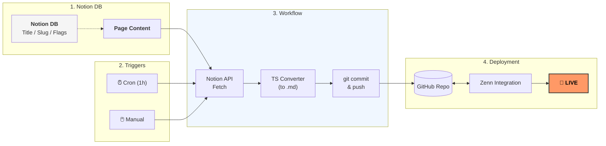

**「Zennの記事管理、Webエディタも良いけれど、普段使い慣れているNotionでサクサク書きたい……。そんな思いから、生成AI（RooCode + Gemini）と協力して、NotionのDBをトリガーにZennへ自動デプロイする仕組みを構築しました。」**

### **2. 技術スタック**

- **Language:** TypeScript
- **CI/CD:** GitHub Actions (Cron実行)
- **Infrastructure:** Notion API / Zenn CLI

---

### **■ 背景：Zenn執筆のDXを最大化したかった**

Zennの公式CLIも便利ですが、画像管理や下書きの整理をNotionで完結させたいと考えました。Notionならスマホからも書きやすく、DBで進捗管理もできるからです。

**Qiitaは未対応です・・・**

### **■ 仕組みの概要**

1. Notionのデータベースに記事を執筆
2. GitHub Actionsが定期実行（Cron）され、Notion API経由でデータを取得
3. 取得した内容をMarkdown化し、GitHubリポジトリへコミット
4. ZennのGitHub連携機能により、自動で記事が公開・更新される

### **■ 導入ステップ**

### **1. Notion側の準備**

### **1-1. データベース定義表**

以下の設定でNotionデータベースを作成してください。

| **プロパティ名**     | **型 (Type)**     | **説明**                                   |
| -------------- | ---------------- | ---------------------------------------- |
| **Title**      | Title            | 記事のタイトル（Notion上の管理名）                     |
| **Slug**       | Text             | Zennのファイル名（URL）になる識別子 (20260326_test など) |
| **Commit**     | Checkbox         | チェックを入れるとGitHubへ同期対象になります                |
| **Publish**    | Checkbox         | `true` で公開、`false` で下書き（Zenn側の設定）        |
| **Emoji**      | Text             | Zennのアイキャッチ用絵文字 （例：🚀, 📚, 🎯）           |
| **Topics**     | Multi-Select     | タグ（複数選択可）                                |
| **Type**       | Select           | `tech` または `idea`（Zennのカテゴリ）             |
| **Updated At** | Last edited time | 最終更新日時（差分チェック用に使用）                       |
| **Platform**   | Text             | Zenn（将来的には的にはQiita、そのほかも・・・）             |

手っ取り早く始めたい方向けに、[[複製用テンプレートURL](/32f692c29cbe801fb006d00eef9a2086?v=32f692c29cbe81318a00000cf27e495c)] も用意しました。

> • **Title**: 記事名  
> • **Slug**: ZennのURLになる文字列  
> • **Commit (Checkbox)**: 同期トリガー。これにチェックがある行のみ処理します。  
> • **本文**: 行を開いて「コメント」欄ではなく、**ページの中身（Page Content）**に記事本文を記載してください。

①【画像】Notion本文の書き方

### **1-2. Notion Integration（合鍵）の作成**

1. [**Notion Integrations ページ**](https://www.notion.so/my-integrations)**にアクセス**
2. **新しいIntegrationを作成**
    - 「Create new integration（新しいインテグレーション）」をクリック
    - 名前を入力（例：「Zenn Sync Bot」）
    - ワークスペースを選択して「Submit」
3. **API Token をコピー**
    - 「Internal Integration Secret（内部インテグレーションシークレット）」を表示してコピーします。
    - **※これは後でGitHubのSecretsに** **`NOTION_API_KEY`** **として登録します。**

### **1-3. データベースへのアクセス権付与**

作成したインテグレーションを、使用するデータベースに「参加」させる必要があります。

1. 作成した**Notionのデータベース画面**を開きます。
2. 右上の **[...]（三点リーダー）** をクリックします。
3. 一番下の **[Connect to（接続先）]** をクリックします。
4. 先ほど作成したインテグレーション名（例：「Zenn Sync Bot」）を検索して選択します。
5. 「はい」を押してアクセスを許可します。

**Caution**

**これを忘れると動きません！**

データベースごとにこの「接続」操作が必要です。複数のDBを使い分ける場合は、それぞれに許可を与えてください。

### **2. GitHub側の設定**

- リポジトリをクローンして自分の管理下へ。
- **Settings > Secrets** に以下の環境変数を設定。
    - `NOTION_API_KEY`
    - `NOTION_DATABASE_ID`

### **2.1. リポジトリの準備**

まずは、ベースとなるソースコードを自分の環境に用意します。

1. [NotionToPosts](https://github.com/sickboy0001/NotionToPosts) を自分のGitHubアカウントへ **Clone** または **Fork** します。
2. Zennとの連携設定がまだの場合は、Zennの管理画面からこのリポジトリを紐付けておいてください。

### **2.2. Secrets（機密情報）の設定**

APIキーなどの秘匿情報を、ソースコードに直接書かずに安全に管理するための設定です。

**設定場所:**

リポジトリのメニューから **[Settings]** ＞ 左サイドバーの **[Secrets and variables]** ＞ **[Actions]** を開きます。

※※場所提示する画像必要

**登録が必要な項目:**

「New repository secret」ボタンを押して、以下の2つを追加してください。

| **Name**             | **Secretの内容**                                |
| -------------------- | -------------------------------------------- |
| `NOTION_API_KEY`     | 先ほどNotionで取得した `Internal Integration Secret` |
| `NOTION_DATABASE_ID` | 使用するNotion DBのURLに含まれるID（※後述）                |

**Important**

**DATABASE_IDの抜き出し方**

Notion DBをブラウザで開き、URLの `https://www.notion.so/XXXXXXXXXX?v=...` の **XXXXXXXXXX**（32文字の英数字）の部分がIDです。

### **2.3. 書き込み権限（Workflow Permissions）の付与**

GitHub Actionsが、Notionから取得した記事ファイルを自分のリポジトリに自動でコミット（保存）できるようにするための権限設定です。**ここを忘れると実行エラーになります。**

1. 同じく **[Settings]** ＞ **[Actions]** ＞ **[General]** を開きます。
2. 一番下の **[Workflow permissions]** セクションで、**「Read and write permissions」**にチェックを入れます。
3. **[Save]** をクリックして保存します。

### **3. 動作確認**

GitHub Actionsの手動実行（workflow_dispatch）またはCron設定で、Zennに記事が反映されるかチェックします。

### **■ 制作の裏側**

- **開発時間:** 約6時間+２時間・・・（最後に苦労した）
- **工夫した点:** ファイル名の重複を避けるため、Slug+日時でユニークなファイル名を生成するようにしました。
- **AI活用:** RooCodeとGeminiを併用。複雑なNotion APIの型定義や、日本語ファイル名のハンドリングもスムーズに解決できました。

### **■ サポート**

- 問題などあれば、こちらへコメントしてもらえれば、調整できる可能性あります。
- 最悪、ローカルで編集してアップでも可能だとは思います。多分生成AIに聞けば結構教えてくれると思います。

### **参考資料**

こにちらのReadMeや、Setupは有効化も

- [NotionToPosts](https://github.com/sickboy0001/NotionToPosts/)

### **宣伝・**

- [choitamelab](https://choitamelab.vercel.app/)

