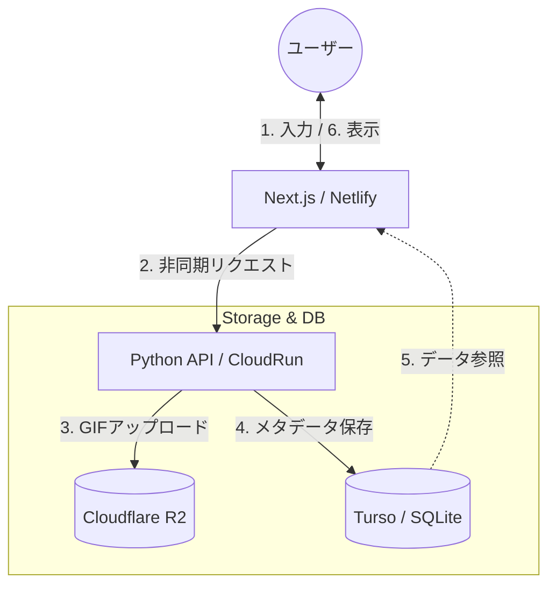

## **1. 動機：なぜ「わざわざ」作ったのか**

GIFは感情やニュアンスを伝える上で非常に強力なメディアですが、既存の作成ツールには「お手軽感」が足りないと感じていました。

多くのツールは **「作成 → ローカル保存 → Xを開く → ファイル選択 → 投稿」** というステップを踏みます。この「一度ローカルに落とす」という手間を極限まで減らし、ブラウザからシームレスにXへシェアできる体験を作りたいと考えたのが「kinemoji」開発の始まりです。

### **実現したかったことと直面した壁**

当初は「生成したURLを投げるだけでX上で動く」状態を目指しましたが、以下の技術的制約にぶつかりました。

- **OGPの限界:** GIFのURLをOGPに設定しても、X上では静止画として展開されてしまう。
- **APIの制約:** X APIによる自動投稿は、不特定多数が利用するサービスとしてはコストやレート制限の面で不向き。

結果として「Web上で生成・プレビューし、ワンクリックで保存・X投稿画面へ誘導する」という、**抵抗感を最小限に抑えたUI/UX**に着地しました。

## **2. システム構成**

パフォーマンスとコストのバランスを考慮し、フロントエンドとバックエンドを分離した構成をとっています。

## **3. 技術スタックの選定理由**

「低コスト」かつ「高い開発効率」を重視しました。

- **Next.js (Netlify):** 開発体験（DX）の良さから採用。VercelではなくNetlifyを選んだのは、特定のベンダーロックインを避けつつ、柔軟な環境を模索するためです。
- **Python + FastAPI (Cloud Run):** 画像処理・GIF生成のライブラリが豊富なPythonを採用。生成処理には時間がかかるため、タイムアウト制限が緩くスケーラビリティが高いCloud Runに切り出しました。
- **Cloudflare R2:** S3互換でエグレス料金（データ転送量）が無料というコストメリットから採用。
- **Turso (SQLite):** ログイン不要のサービスですが、生成履歴の管理のために軽量なエッジデータベースとして採用しました。

## **4. 生成AI（RooCode）をフル活用した開発プロセス**

今回の開発の目玉は、**VSCode + RooCode (Gemini / Qwen)** による「AI駆動開発」です。

### **アニメーションロジックの移植**

特に苦労したのは、GIF生成ロジックの二重実装です。

1. **Python側:** サーバーサイドでの本番用GIF生成（Pillow等を使用）
2. **Next.js側:** フロントエンドでのリアルタイムプレビュー用アニメーション

Pythonでロジックを完成させた後、そのソースコードをRooCodeに渡し、**「このロジックをTypeScriptで再現して」**と依頼することで、複雑なアニメーション同期を短時間で実現しました。AIがいなければ、この移植作業だけで数倍の時間がかかっていたはずです。

## **5. 最大の壁と乗り越えたポイント**

### **タイムアウトとサーバー環境の罠**

当初はNetlify Functions内でGIF生成まで完結させようとしましたが、2つの問題が発生しました。

1. **実行時間制限:** 高解像度・高FPSのGIF生成がタイムアウトする。
2. **依存ライブラリ:** デプロイ環境で画像関連のバイナリモジュールが動作しないエラーが多発。

**解決策:** 「画像生成はPythonの方が強い」と割り切り、バックエンドをCloud Runへ分離。非同期での呼び出し（生成開始だけ指示して、フロント側で完了をポーリング/参照する形式）にすることで、UIのフリーズを防ぎました。

## **6. リリースして得た知見**

- **環境の使い分け:** 「何でもNext.jsでやる」のではなく、重い処理やライブラリ依存が強い処理は、適切な言語（Python等）と適切なインフラ（Cloud Run等）に切り出す勇気が重要。
- **Netlifyの課金体系:** 頻繁なデプロイによりBuild minutesの上限に達し、Proプラン（$10/月）へのアップグレードが必要になるという発見がありました。
- **React/Next.jsの優位性:** 開発効率を追求するなら、現状Reactエコシステムに全振りしたNext.jsが最強の選択肢の一つであると再認識しました。

## **まとめと今後の展望**

現在は「ル〇ン三世風」のGIF生成などを実装していますが、このアーキテクチャであれば、ロジックを追加するだけで様々なバリエーションのGIFジェネレーターを量産できます。

「特定の環境の制限に縛られず、最適なツールを組み合わせて最短距離で実装する」。AI時代における個人開発の最適なパターンかなと。

https://kinemoji.netlify.app/kinemoji/5f69fb79

